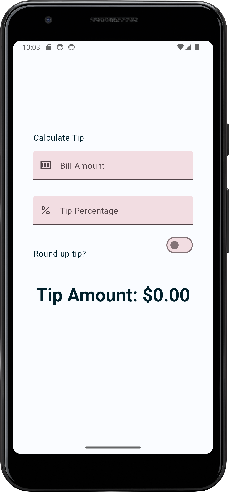
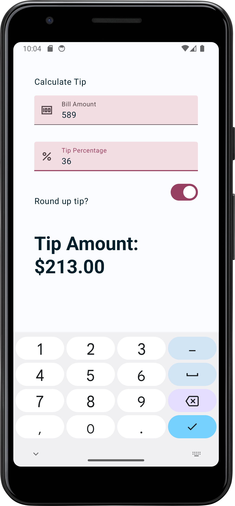

# Tip Calculator App

A simple **Tip Calculator** app built using **Kotlin** and **Jetpack Compose**. This app allows users to calculate the tip amount based on the bill total and tip percentage. The app includes custom input fields with tailored keyboard options for an intuitive and user-friendly experience. Additionally, unit and instrumentation tests were implemented to ensure app reliability and correctness.

## Challenges Faced / Key Learnings

- **State Hoisting**: Managing the app's state efficiently was achieved using **state hoisting**, allowing seamless communication between Composables and consistent UI updates.

- **Custom Input Fields with Keyboard Options**: 
  - I used **keyboardOptions** to modify the type of keyboard displayed to the user for numerical input. This ensured that only relevant keys were shown, enhancing the app's usability.
  - Additionally, the **keyboard action button** was customized (e.g., "Done" or "Next") to guide users through the form intuitively. Implementing this feature helped me understand how to provide better navigation through user inputs.

- **Testing**:
  - I implemented **unit tests** to validate core business logic, such as calculating the tip amount based on different bill values and tip percentages.
  - **Instrumentation tests** were used to ensure the UI components, such as input fields and buttons, behaved correctly during user interactions.
  - This practice reinforced the importance of automated testing in delivering reliable and bug-free applications.

## Screenshots





## Installation

### Prerequisites
- **Android Studio** installed on your machine.
- Android emulator or a physical device for testing.

### How to Run the App

1. Clone the repository:
   ```bash
   git clone https://github.com/Pranav24k/Tip-Calculator.git
